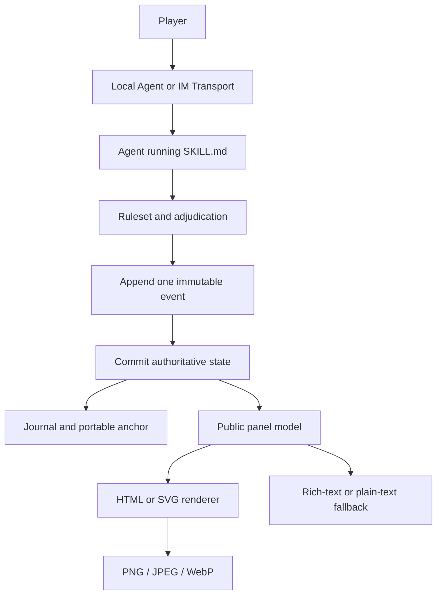

# LOTM Text Game Skill

**English** · [简体中文](README_CN.md)

A persistent, consequence-driven text adventure inspired by *Lord of Mysteries*, built as a portable Agent Skill.

Play an ordinary person living in Tingen on June 28, 1349—the same world and time in which Klein Moretti has just awakened. Choose any plausible life, pursue any faction or Pathway, interfere with familiar events, or ignore them entirely. The world keeps moving, and every meaningful action can bend its future.

This is a game engine, not a scripted story. It combines open-ended role-play with explicit adjudication, durable campaign state, canon-aware knowledge boundaries, deterministic status panels, and transport contracts for local agents and IM platforms.

## Why it is fun

| System | What it adds to play |
|---|---|
| Free-form action | Suggested choices never lock the player into a menu. Any plausible in-world action can be attempted. |
| A living timeline | Factions, threats, and major events continue to develop even when the player looks elsewhere. |
| Real consequences | Money, injuries, suspicion, relationships, corruption, and missed timing all persist. |
| Sequence progression | Potions, acting, spirituality, rituals, ingredients, and loss-of-control risk form one connected advancement loop. |
| Butterfly effects | Interventions accumulate causal weight and can redirect major story anchors without turning canon characters into puppets. |
| No save-scumming | Rolls and consequences are committed once. Recovery restores interrupted writes; it never rerolls history. |
| Three difficulty modes | Play a fate-favored adventure, a grounded ordinary life, or a hostile survival campaign. |
| Optional illustrations | Important people, objects, and scenes can receive generated artwork after the core turn is complete and the player agrees. |

## Core design

The engine separates game truth from presentation. An HTML failure, Telegram retry, or image-generation timeout can never alter a roll or advance the clock.



| Layer | Responsibility | Main files |
|---|---|---|
| Agent contract | Loads the correct rules and preserves turn order | `SKILL.md` |
| Game semantics | World, character creation, Pathways, checks, advancement, causality, and endings | `references/ruleset.md` |
| Persistence | Campaign scoping, append-only events, atomic state, concurrency, and recovery | `references/runtime-and-storage.md` |
| Transport | Telegram and generic IM delivery, deduplication, buttons, and outbox behavior | `references/transport-adapters.md` |
| Presentation | Public-data boundaries, mobile status cards, semantic color, and illustration consent | `references/visual-media.md` |
| Deterministic UI | Validates one public model and renders self-contained HTML or SVG | `scripts/render_panel.py` |

## Installation

Clone the repository directly into your Codex skills directory:

```bash
git clone https://github.com/zyfayes/lotm-text-game-skill.git \
  ~/.codex/skills/lotm-text-game
```

Restart or refresh the Agent, then invoke:

```text
Use $lotm-text-game to start a new game.
```

Other Agent runtimes that support directory-based skills can load the root `SKILL.md` and preserve the same relative file structure.

## What happens when a campaign starts

1. The player chooses a difficulty.
2. The player chooses a gender.
3. The Agent generates four fresh character backgrounds plus a custom option.
4. The player names the protagonist.
5. The engine creates the durable campaign ledger and immediately renders the first status panel.
6. The opening scene begins with free-form actions and suggested choices.

Campaigns start with an ordinary person or, for a balanced custom background, at most a Sequence 9 Beyonder with a real cost attached.

## Campaign persistence

For a local single-player campaign, the engine maintains:

```text
campaigns/
├── active.yaml
└── <campaign_id>/
    ├── state.yaml
    ├── events.jsonl
    ├── journal.md
    ├── canon-deviations.md
    └── latest-anchor.md
```

`state.yaml` is the latest authoritative state. `events.jsonl` is an append-only audit trail. The journal contains only facts the character has experienced or confirmed. Hidden world state and character knowledge remain separate.

Service deployments may map the same records to SQLite, PostgreSQL, or object storage, but must preserve version checks, idempotency, transaction order, and recovery semantics.

## Rendering status panels

The renderer uses only the Python standard library:

```bash
python3 scripts/render_panel.py \
  --input assets/panel-example.json \
  --format html \
  --output status.html

python3 scripts/render_panel.py \
  --input assets/panel-example.json \
  --format svg \
  --output status.svg
```

The generated HTML and SVG are self-contained. For Telegram, Discord, and similar chat platforms, rasterize them to PNG, JPEG, or WebP before delivery. If visual rendering fails, the engine falls back to platform-rich text and then plain text without changing campaign state.

The UI does not use a universal MMO-style rarity ladder. Sealed Artifact grades, event danger, Sequence level, formula confidence, and publicly confirmed item types remain separate concepts. Color supports those known meanings but never performs a hidden appraisal.

## Repository structure

```text
.
├── SKILL.md
├── agents/
│   └── openai.yaml
├── assets/
│   ├── dossier-masthead-engraving.png
│   ├── icon.svg
│   ├── panel-example.json
│   └── panel-example.png
├── references/
│   ├── public-panel.schema.json
│   ├── ruleset.md
│   ├── runtime-and-storage.md
│   ├── transport-adapters.md
│   └── visual-media.md
└── scripts/
    └── render_panel.py
```

## Safety and privacy

- Live campaign data, player media, chat identifiers, credentials, and bot tokens do not belong in the reusable Skill.
- Player-visible panels and image prompts may contain only publicly established facts.
- Duplicate webhooks, callback retries, or failed uploads must never adjudicate the same action twice.
- Optional illustrations are cosmetic. They cannot create items, reveal secrets, consume resources, or advance time.

## Disclaimer

This is an unofficial, non-commercial fan project. It is not affiliated with or endorsed by China Literature, Qidian, the author Cuttlefish That Loves Diving, or any official license holder. Names, characters, settings, and other elements originating from *Lord of Mysteries* remain the property of their respective rights holders.

The worldbuilding, game rules, and presentation also draw inspiration from ideas shared online by readers, tabletop role-playing players, and text-game enthusiasts. This repository is provided solely for learning and community discussion.

The MIT License applies only to original software, operating protocols, and interface implementation for which the repository author has authority to grant permission. It does not grant rights to third-party intellectual property. Users are responsible for ensuring that their deployment, distribution, and generated content comply with applicable law and platform rules.
