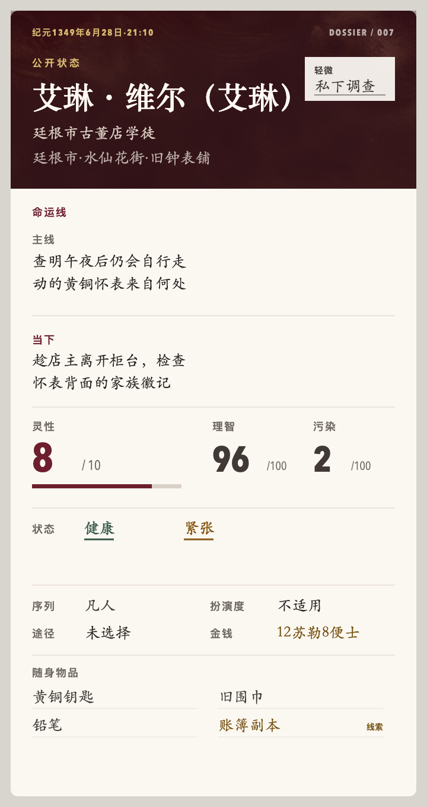

# LOTM Text Game Skill

一个可持久化、跨平台的《诡秘之主》文字冒险 Skill。它把世界规则、判定、战役状态、聊天平台适配与视觉面板分离，使同一局游戏可以在 Codex、本地 Agent 或 Telegram 等 IM 环境中连续运行。



## 特性

- 基于序列、灵性、理智、污染、扮演法和封印物的完整游戏规则
- 自由行动、统一 d100 判定、反作弊与正典知识边界
- `state.yaml` 权威状态与只追加 `events.jsonl` 事件账本
- HTML／SVG 确定性状态面板，可光栅化为 Telegram 兼容图片
- 关键人物、道具与场景的可选沉浸插图协议
- 多会话、幂等、并发与故障恢复约束

## 安装

将整个仓库复制到 Agent 的 Skill 目录：

```bash
git clone https://github.com/zyfayes/lotm-text-game-skill.git
cp -R lotm-text-game-skill ~/.codex/skills/lotm-text-game
```

重新启动或刷新 Agent 后，可以这样调用：

```text
使用 $lotm-text-game 开一局。
```

支持 Skill 目录约定的其他 Agent，也可以直接加载根目录的 `SKILL.md`。

## 目录

```text
SKILL.md                         Skill 入口与运行契约
agents/openai.yaml               Codex UI 元数据
references/ruleset.md            完整游戏规则
references/runtime-and-storage.md
references/transport-adapters.md
references/visual-media.md
references/public-panel.schema.json
scripts/render_panel.py          HTML／SVG 状态面板渲染器
assets/                          示例模型、预览与装饰素材
```

## 渲染状态面板

渲染器只依赖 Python 标准库：

```bash
python3 scripts/render_panel.py \
  --input assets/panel-example.json \
  --format html \
  --output status.html

python3 scripts/render_panel.py \
  --input assets/panel-example.json \
  --format svg \
  --output status.svg
```

在 Telegram、Discord 等普通 IM 中，应把 HTML 或 SVG 光栅化为 PNG、JPEG 或 WebP 后发送。渲染失败只触发表现层降级，不会推进时间、重掷或改变战役状态。

## 设计原则

- 游戏事实只有一个权威来源，渲染器不能猜测状态。
- 普通道具没有统一的 MMO 式稀有度；封印物等级、事件危险度、序列层次和配方可信度分别表达。
- 颜色只辅助表达已经公开的语义，不承担隐藏鉴定。
- 插图不建立新事实，也不能泄露角色未知信息。
- 发布包不包含任何玩家战役、聊天标识、令牌或生成中的私人媒体。

## 免责声明

这是一个非官方、非商业的同人项目，与阅文集团、起点中文网、作者爱潜水的乌贼及任何官方授权方无隶属或背书关系。《诡秘之主》相关名称、角色、世界观与原作设定的权利归各自权利人所有。

MIT License 仅适用于本仓库原创的程序代码、运行协议和界面实现，不授予任何第三方知识产权许可。使用者应自行确保其部署、传播和生成内容符合所在地法律及相关平台规则。
