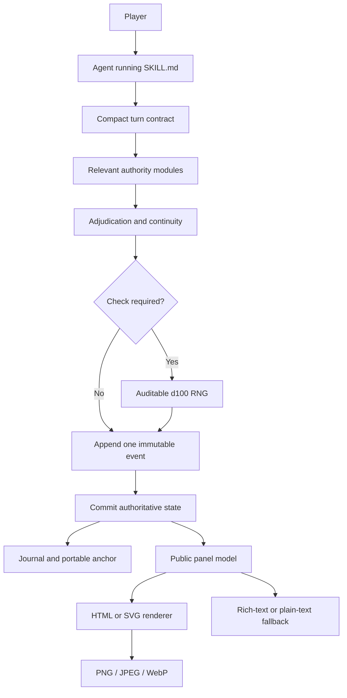

# LOTM Text Game Skill

**English** · [简体中文](README_CN.md)

A persistent, consequence-driven text adventure inspired by *Lord of Mysteries*, built as a portable Agent Skill.

Play an ordinary person living in Tingen on June 28, 1349—the same world and time in which Klein Moretti has just awakened. Choose any plausible life, pursue any faction or Pathway, interfere with familiar events, or ignore them entirely. The world keeps moving, and every meaningful action can bend its future.

This is a game engine, not a scripted story. It combines open-ended role-play with explicit adjudication, durable campaign state, canon-aware knowledge boundaries, and deterministic status panels in one Agent workspace.

## Why it is fun

| System | What it adds to play |
|---|---|
| Free-form action | Suggested choices never lock the player into a menu. Any plausible in-world action can be attempted. |
| A living timeline | Factions, threats, and major events continue to develop even when the player looks elsewhere. |
| Real consequences | Money, injuries, suspicion, relationships, corruption, and missed timing all persist. |
| Social power with limits | Personal trust, public standing, organization rank, explicit permissions, reputation, and heat are tracked separately. A trusted friend cannot silently grant institutional authority. |
| Commitments and livelihood | Favors, promises, contracts, oaths, leverage, wages, living costs, treatment, scarcity, and financial debt persist without turning every meal into bookkeeping. |
| Fair risk and failure | Irreversible checks disclose foreseeable stakes first; failure changes the situation and leaves a new way forward. |
| Solvable mysteries | Required conclusions keep independent clue routes, while evidence carries source, confidence, and verification state. |
| Sequence progression | Potions, acting, spirituality, rituals, ingredients, and loss-of-control risk form one connected advancement loop. |
| Butterfly effects | Interventions accumulate causal weight and can redirect major story anchors without turning canon characters into puppets. |
| No save-scumming | Rolls and consequences are committed once. Recovery restores interrupted writes; it never rerolls history. |
| Auditable randomness | Checks use the operating-system CSPRNG, a committed HMAC stream, or another verifiable runtime source and store the raw roll, context, source receipt when present, and adjudication. |
| Three difficulty modes | Play a fate-favored adventure, a grounded ordinary life, or a hostile survival campaign. |
| Chapters with momentum | Every chapter carries a core question and pressure source, then closes only after an irreversible change. |
| Adjustable intensity | Horror, gore, romance, canon spoilers, and hard limits have safe defaults and can be changed without advancing game time. |
| Optional illustrations | Important people, objects, and scenes can receive generated artwork after the core turn is complete and the player agrees. |

## Winning, losing, and campaign length

After the first meaningful scene, the Agent offers four life goals tailored to the character's background and public story hooks, plus a free-entry option. Typical directions include freedom, truth or revenge, Beyonder mastery, status or belonging, and protecting someone or changing a fate. Before a goal is locked, the player confirms one to three observable success conditions. Every completed condition points to committed event evidence, preventing the ending threshold from drifting later.

| Outcome | Meaning |
|---|---|
| Victory | The life goal is fulfilled and the player chooses to conclude the campaign. |
| Unfinished | The player retires before completing the current life goal. |
| Defeat | The character irreversibly dies, loses control, is assimilated, or permanently loses agency with no plausible in-world recovery. |

Completing a goal opens an ending choice; it does not force the campaign to stop. The player may archive that goal and choose another. Temporary failure, imprisonment, debt, injury, or a broken relationship remains part of play rather than an automatic defeat.

Every ending also receives an independent legacy scale—Mortal, Beyonder, Legendary, or Mythic—based on causal impact rather than Sequence alone. A mortal can win and leave a legend; a powerful Beyonder can fail.

| Pacing profile | Expected shape |
|---|---|
| Compact | About 12–20 meaningful scenes across 3–4 chapters |
| Standard | About 30–60 meaningful scenes across 5–8 chapters; the default |
| Saga | 80+ meaningful scenes for multi-city, multi-faction, or high-Sequence play |

These are visible expectations, not hard turn limits. A meaningful scene must contain a real choice, discovery, consequence, relationship change, or world advance. If two consecutive scenes produce none of those, the Agent must compress the transition or move to the next effective node. Players can change pacing at any time without changing difficulty or advancing the world clock.

A chapter normally spans four to eight meaningful scenes, but its dramatic contract matters more than the count: one understandable question, one source of pressure, and at least one lasting change. Closing a chapter rechecks the life goal, relationships, clues, world clocks, organizations, economy, and commitments, updating only what actually changed.

## Core design

The engine separates game truth from presentation. A rendering, delivery, or image-generation failure can never alter a roll or advance the clock.



| Layer | Responsibility | Main files |
|---|---|---|
| Agent contract | Loads the compact turn contract, escalates to the correct authority modules, and preserves turn order | `SKILL.md`, `references/runtime-core.md` |
| Game semantics | One authority index plus seven focused modules for core play, canon, Pathways, adjudication, causality, presentation, and appendices | `references/ruleset.md` and its seven linked modules |
| Persistence | Agent workspace, append-only events, atomic state, campaign switching, and recovery | `references/runtime-and-storage.md` |
| Presentation | Public-data boundaries, mobile status cards, semantic color, and illustration consent | `references/visual-media.md` |
| Deterministic UI | Validates one public model and renders self-contained HTML or SVG | `scripts/render_panel.py` |
| Runtime integrity | Generates auditable checks and validates, commits, or recovers state patches | `scripts/roll_check.py`, `scripts/campaign_runtime.py` |
| Portability QA | Detects omitted rule volumes, authority drift, Markdown strikethrough hazards, raw HTML, and mobile-hostile tables | `scripts/check_rules.py`, `scripts/check_markdown.py` |

## Runtime loading and latency

Every gameplay request loads the compact `turn-core-v1` contract. Full authority modules are loaded for campaign creation, migration, recovery, digest changes, consistency failures, and only the rule domains touched by an ordinary turn. The complete rules remain authoritative; the compact contract supplies safety invariants and a conservative escalation router.

`references/rules-manifest.json` binds the compact contract and cached rule files to SHA-256 digests. A cache hit is valid only when the current model can access the matching rule text. A stored flag or old conversation memory cannot stand in for the content.

An ordinary turn should load a revision-bound working set instead of the full event history: current state fields relevant to the action, active goal and chapter, nearby clocks and investigations, related social or economy records, the last two to four events, and any older prerequisite event references. A stale or incomplete projection falls back to authoritative state.

Local validation, RNG, and commits are deterministic and lightweight. Model inference and media rendering dominate user-visible latency. Required status information therefore has a same-revision text path when a card is delayed, while optional AI illustrations always run asynchronously after the core turn and player consent.

## Installation

Clone the repository directly into your Codex skills directory:

```bash
git clone https://github.com/zyfayes/lotm-text-game-skill.git \
  ~/.codex/skills/lotm-text-game
```

Restart or refresh the Agent, then invoke:

```text
Use $lotm-text-game to start a new game.
```

Other Agent runtimes that support directory-based skills can load the root `SKILL.md` and preserve the same relative file structure.

### Automatic updates

A Git-installed Skill checks its `origin/main` once on first activation in each Agent process or session. The check has a short timeout and never blocks play on the installed version.

An update is applied only when the checkout is clean and the remote commit is a fast-forward. The updater never resets local changes, runs the test suite during play, or touches campaign data. Copied packages keep working without self-update. Set `LOTM_AUTO_UPDATE=0` to opt out. Run the standard validation suite before publishing changes to `main`.

## What happens when a campaign starts

1. The player chooses a difficulty.
2. The player chooses a gender.
3. The Agent generates four fresh character backgrounds plus a custom option.
4. The player names the protagonist.
5. The engine creates the durable campaign ledger and immediately renders the first status panel.
6. The opening scene begins with free-form actions and suggested choices.
7. After the first meaningful scene, the player chooses or writes a life goal and confirms the campaign pacing.

Campaigns start with an ordinary person or, for a balanced custom background, at most a Sequence 9 Beyonder with a real cost attached.

New campaigns use the v1.7 state and event contracts. Content defaults are written immediately—standard horror, restrained gore, romance by consent, character-only canon spoilers, and no supplied hard limits—without adding a long setup interview. Players can change them at any time.

Each campaign has one protagonist and one authoritative action sequence.

The original v1.6 schemas remain byte-preserved compatibility resources. Installing v1.7 never rewrites a v1.6 campaign automatically; migration requires an explicit request and an appended migration event. Earlier v1.2–v1.5 ledgers can be recognized and continuity-checked in read-only mode, while write, recovery, and anchor-export operations stay blocked until explicit migration.

## Campaign persistence

The Agent stores every campaign under its writable workspace. The user may supply another workspace root, but the selected absolute path stays fixed for the session. Live data never belongs inside the reusable Skill package.

The engine maintains:

```text
<agent-workspace>/.lotm-text-game/campaigns/
├── active.yaml
└── <campaign_id>/
    ├── state.yaml
    ├── events.jsonl
    ├── journal.md
    ├── canon-deviations.md
    └── latest-anchor.md
```

`state.yaml` is the latest authoritative state. `events.jsonl` is an append-only audit trail. The journal contains only facts the character has experienced or confirmed. Hidden world state and character knowledge remain separate.

The v1.7 runtime records goal evidence, clues and investigations, public stakes, RNG provenance, consequences, and old-value-checked state patches. It also validates organization authority, social standing, commitments, financial flows, chapter transitions, content preferences, and canon-source confidence. Local agents can validate or recover a campaign with:

```bash
python3 scripts/campaign_runtime.py validate --campaign-dir /absolute/workspace/.lotm-text-game/campaigns/example-campaign
python3 scripts/campaign_runtime.py recover --campaign-dir /absolute/workspace/.lotm-text-game/campaigns/example-campaign
```

The check helper can inspect calibrated odds or generate a real roll:

```bash
python3 scripts/roll_check.py odds --mode ordinary --target 100 --attribute 45 --skill 10
python3 scripts/roll_check.py roll --mode ordinary --target 100 --attribute 45 --skill 10 \
  --context evt-000042:inspect-door
```

## Rendering status panels

The renderer uses only the Python standard library:

```bash
python3 scripts/render_panel.py \
  --input assets/panel-example.json \
  --format html \
  --output status.html

python3 scripts/render_panel.py \
  --input assets/panel-example.json \
  --format svg \
  --output status.svg
```

The generated HTML and SVG are self-contained. If the current interface cannot display them directly, rasterize them to PNG, JPEG, or WebP. If visual rendering fails, the engine falls back to rich text and then plain text without changing campaign state.

The UI does not use a universal MMO-style rarity ladder. Sealed Artifact grades, event danger, Sequence level, formula confidence, and publicly confirmed item types remain separate concepts. Color supports those known meanings but never performs a hidden appraisal.

## Repository structure

```text
.
├── SKILL.md
├── agents/
│   └── openai.yaml
├── assets/
│   ├── dossier-masthead-engraving.png
│   ├── icon.svg
│   ├── panel-example.json
│   └── panel-example.png
├── references/
│   ├── public-panel.schema.json
│   ├── campaign-state.schema.json
│   ├── campaign-event.schema.json
│   ├── portable-anchor.schema.json
│   ├── campaign-state.v1.6.schema.json
│   ├── campaign-event.v1.6.schema.json
│   ├── portable-anchor.v1.6.schema.json
│   ├── ruleset.md
│   ├── rules-manifest.json
│   ├── runtime-core.md
│   ├── core-rules.md
│   ├── canon-and-world.md
│   ├── pathways-and-powers.md
│   ├── adjudication-and-systems.md
│   ├── causality-and-continuity.md
│   ├── presentation.md
│   ├── appendices.md
│   ├── runtime-and-storage.md
│   └── visual-media.md
├── scripts/
│   ├── campaign_runtime.py
│   ├── check_rules.py
│   ├── check_markdown.py
│   ├── self_update.py
│   ├── roll_check.py
│   └── render_panel.py
└── tests/
    ├── test_p0_runtime.py
    ├── test_p1_runtime.py
    ├── test_self_update.py
    └── test_portability.py
```

Run the standard-library regression suite with:

```bash
python3 -m unittest discover -s tests -v
python3 scripts/check_rules.py
python3 scripts/check_markdown.py README.md README_CN.md SKILL.md references
```

## Safety and privacy

- Live campaign data, generated player media, and credentials do not belong in the reusable Skill.
- Player-visible panels and image prompts may contain only publicly established facts.
- Recovery or repeated output must never adjudicate the same player action twice.
- Optional illustrations are cosmetic. They cannot create items, reveal secrets, consume resources, or advance time.

## Disclaimer

This is an unofficial, non-commercial fan project. It is not affiliated with or endorsed by China Literature, Qidian, the author Cuttlefish That Loves Diving, or any official license holder. Names, characters, settings, and other elements originating from *Lord of Mysteries* remain the property of their respective rights holders.

The worldbuilding, game rules, and presentation also draw inspiration from ideas shared online by readers, tabletop role-playing players, and text-game enthusiasts. This repository is provided solely for learning and community discussion.

The MIT License applies only to original software, operating protocols, and interface implementation for which the repository author has authority to grant permission. It does not grant rights to third-party intellectual property. Users are responsible for ensuring that their deployment, distribution, and generated content comply with applicable law and platform rules.
