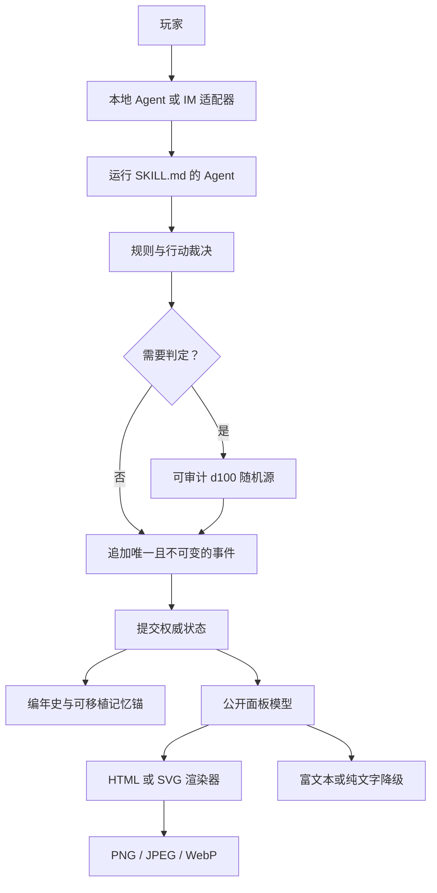

# LOTM Text Game Skill

[English](README.md) · **简体中文**

一款受《诡秘之主》启发、能够长期保存进度并承担真实后果的文字冒险，也是一份可移植的 Agent Skill。

你将在纪元 1349 年 6 月 28 日的廷根醒来，与刚刚苏醒的克莱恩·莫雷蒂生活在同一座城市、同一段历史中。你可以选择任何合理的人生，追随不同途径与势力，干预熟悉的事件，也可以完全绕开它们。世界不会等待玩家，每一次有意义的行动都可能改变未来。

这是一套游戏引擎，而非预先写好的互动小说。它把自由角色扮演、明确判定、持久化战役、正典知识边界、确定性状态面板与 IM 平台适配组合在一起。

## 为什么好玩

| 系统 | 带来的游戏体验 |
|---|---|
| 自由行动 | 推荐选项不会把玩家锁进菜单，任何合理的世界内行为都可以尝试。 |
| 持续运转的世界 | 势力、威胁和重大事件会继续发展，不会停下来等待玩家。 |
| 真实后果 | 金钱、伤势、怀疑、关系、污染与错过的时机都会持续保留。 |
| 公平风险与失败 | 不可逆判定先说明角色可预见的风险；失败会改变局势，并留下新的行动方向。 |
| 可解的谜题 | 必需结论保留独立线索路径，证据记录来源、可信度和验证状态。 |
| 序列成长 | 魔药、扮演、灵性、仪式、材料与失控风险构成完整的晋升循环。 |
| 蝴蝶效应 | 玩家干预会积累因果值，可以改变重大命运锚点，却无法把正典角色变成傀儡。 |
| 不可读档重掷 | 骰点与后果只结算一次；故障恢复只修复中断写入，不会重掷历史。 |
| 可审计随机 | 判定使用系统安全随机源、已承诺的 HMAC 随机流或平台可验证随机源，并记录原始骰、上下文、计数器或平台凭证，以及最终裁决。 |
| 三种难度 | 可以体验命运眷顾、平凡求生，或者充满恶意的地狱旅程。 |
| 可选沉浸插图 | 在核心信息输出完成并取得玩家同意后，可为关键人物、道具和场景生成插图。 |

## 胜负与游戏长度

第一场有意义的场景结束后，Agent 会根据角色背景和已公开的命运钩子提供四个「命运志向」，同时支持自由填写。常见方向包括获得自由、追索真相或复仇、掌握非凡力量、获得地位或归属，以及保护某个人或改变一场命运。锁定志向前，玩家会确认一至三条可观察的成功条件；完成条件必须引用已经提交的事件证据，终局门槛不会在后续被临时改变。

| 结果 | 含义 |
|---|---|
| 胜利 | 完成命运志向，并由玩家选择在此结束战役。 |
| 未竟 | 玩家在当前志向完成前主动退休。 |
| 败亡 | 角色不可逆死亡、完全失控或同化，或者永久失去自主行动能力且没有合理的世界内恢复路径。 |

完成志向只会开启终局选择，不会强制结束。玩家可以归档旧目标并选择新的志向。暂时失败、被捕、负债、受伤或关系破裂仍是游戏的一部分，不会自动判负。

每个结局还会获得独立的影响评级：凡尘、非凡、传奇或神话。它衡量因果影响，而非单纯比较序列。凡人可以胜利并留下传奇，高序列角色也可能败亡。

| 节奏档 | 预期长度 |
|---|---|
| 紧凑 | 约 12～20 个有意义场景，分为 3～4 章 |
| 标准 | 约 30～60 个有意义场景，分为 5～8 章；默认选项 |
| 长篇 | 80 个以上有意义场景，适合多城市、多势力或高序列生涯 |

这些数字是公开的体验预期，不是强制回合上限。有意义场景必须包含真实选择、发现、后果、关系变化或世界推进；如果连续两个场景都没有产生这些内容，Agent 必须压缩过场或进入下一个有效节点。玩家可以随时切换节奏，不会改变难度或推进世界时间。

## 核心架构

游戏事实与表现层完全分离。HTML 渲染失败、Telegram 重试或图片生成超时，都不能改变骰点、推进时间或重写战役状态。



| 层级 | 职责 | 主要文件 |
|---|---|---|
| Agent 契约 | 加载正确规则并保证回合事务顺序 | `SKILL.md` |
| 游戏语义 | 世界、角色创建、风险预告、线索闭环、判定、成长、因果与结局 | `references/ruleset.md` |
| 持久化 | 战役隔离、只追加事件、原子状态、并发与恢复 | `references/runtime-and-storage.md` |
| 传输层 | Telegram 与通用 IM 投递、去重、按钮和 outbox | `references/transport-adapters.md` |
| 表现层 | 公开信息边界、移动端状态卡、语义色与插图授权 | `references/visual-media.md` |
| 确定性 UI | 校验公开模型并生成自包含 HTML 或 SVG | `scripts/render_panel.py` |
| 运行时完整性 | 生成可审计判定，并校验、提交或恢复状态补丁 | `scripts/roll_check.py`、`scripts/campaign_runtime.py` |

## 安装

将仓库直接克隆到 Codex Skill 目录：

```bash
git clone https://github.com/zyfayes/lotm-text-game-skill.git \
  ~/.codex/skills/lotm-text-game
```

重新启动或刷新 Agent，然后输入：

```text
使用 $lotm-text-game 开一局。
```

其他支持目录式 Skill 的 Agent 也可以加载根目录的 `SKILL.md`，但需要保留仓库内部的相对路径结构。

## 一局游戏如何开始

1. 玩家选择难度。
2. 玩家选择性别。
3. Agent 当场生成四张新背景卡，并提供自定义选项。
4. 玩家亲自为主角命名。
5. 引擎建立持久化战役账本，并立即生成第一张状态面板。
6. 开局场景开始，同时提供推荐选项与自由行动。
7. 第一场有意义的场景结束后，玩家选择或填写命运志向，并确认战役节奏。

角色默认以普通人开局。平衡校验通过的自定义角色最高可以从序列 9 开始，但必须承担真实代价。

新战役使用 v1.6 状态和事件契约。安装新版 Skill 不会自动改写旧战役；迁移需要玩家明确提出，并追加迁移事件。

## 战役持久化

本地单人战役使用以下结构：

```text
campaigns/
├── active.yaml
└── <campaign_id>/
    ├── state.yaml
    ├── events.jsonl
    ├── journal.md
    ├── canon-deviations.md
    └── latest-anchor.md
```

`state.yaml` 保存最新权威状态，`events.jsonl` 是只追加的完整审计记录。编年史只记录角色亲历或已经确认的事实；隐藏世界状态与角色知识严格分离。

v1.6 运行时会记录目标证据、线索与调查、公开风险、随机来源、后果及带旧值校验的状态补丁。本地 Agent 可以运行：

```bash
python3 scripts/campaign_runtime.py validate --campaign-dir campaigns/<campaign_id>
python3 scripts/campaign_runtime.py recover --campaign-dir campaigns/<campaign_id>
```

判定工具既可检查概率，也可生成真实骰点：

```bash
python3 scripts/roll_check.py odds --mode ordinary --target 100 --attribute 45 --skill 10
python3 scripts/roll_check.py roll --mode ordinary --target 100 --attribute 45 --skill 10 \
  --context evt-000042:inspect-door
```

服务端部署可以把这些记录映射到 SQLite、PostgreSQL 或对象存储，但必须保留版本校验、幂等、事务顺序和故障恢复语义。

## 渲染状态面板

渲染器只依赖 Python 标准库：

```bash
python3 scripts/render_panel.py \
  --input assets/panel-example.json \
  --format html \
  --output status.html

python3 scripts/render_panel.py \
  --input assets/panel-example.json \
  --format svg \
  --output status.svg
```

生成的 HTML 与 SVG 均为自包含文件。在 Telegram、Discord 等聊天平台中，应先将其光栅化为 PNG、JPEG 或 WebP。如果视觉渲染失败，引擎会依次降级到平台富文本和纯文字，同时保持战役状态不变。

界面没有 MMO 式的全局稀有度。封印物等级、事件危险度、序列层次、配方可信度与公开确认的物品类型分别表达；颜色只辅助已知语义，不会替玩家进行隐藏鉴定。

## 仓库结构

```text
.
├── SKILL.md
├── agents/
│   └── openai.yaml
├── assets/
│   ├── dossier-masthead-engraving.png
│   ├── icon.svg
│   ├── panel-example.json
│   └── panel-example.png
├── references/
│   ├── public-panel.schema.json
│   ├── campaign-state.schema.json
│   ├── campaign-event.schema.json
│   ├── portable-anchor.schema.json
│   ├── ruleset.md
│   ├── runtime-and-storage.md
│   ├── transport-adapters.md
│   └── visual-media.md
├── scripts/
│   ├── campaign_runtime.py
│   ├── roll_check.py
│   └── render_panel.py
└── tests/
    └── test_p0_runtime.py
```

运行标准库回归测试：

```bash
python3 -m unittest discover -s tests -v
```

## 安全与隐私

- 可复用 Skill 不应包含真实战役数据、玩家媒体、聊天标识、凭据或机器人令牌。
- 玩家可见面板与插图提示词只能使用已经公开的事实。
- 重复 webhook、按钮重试和上传失败不得重复结算同一个行动。
- 可选插图只负责表现，不能生成物品、泄露秘密、消耗资源或推进时间。

## 免责声明

这是一个非官方、非商业的同人项目，与阅文集团、起点中文网、作者爱潜水的乌贼及任何官方授权方不存在隶属、授权或背书关系。源自《诡秘之主》的名称、角色、世界观及其他元素，其权利归各自权利人所有。

本项目的世界观表达、游戏规则与呈现方式，也受到网络上小说读者、桌面角色扮演玩家和文字游戏爱好者分享内容的启发，仅供学习与交流使用。

MIT License 只适用于仓库作者有权授权的原创程序代码、运行协议与界面实现，不授予任何第三方知识产权许可。使用者有责任确保其部署、传播与生成内容符合适用法律和平台规则。
